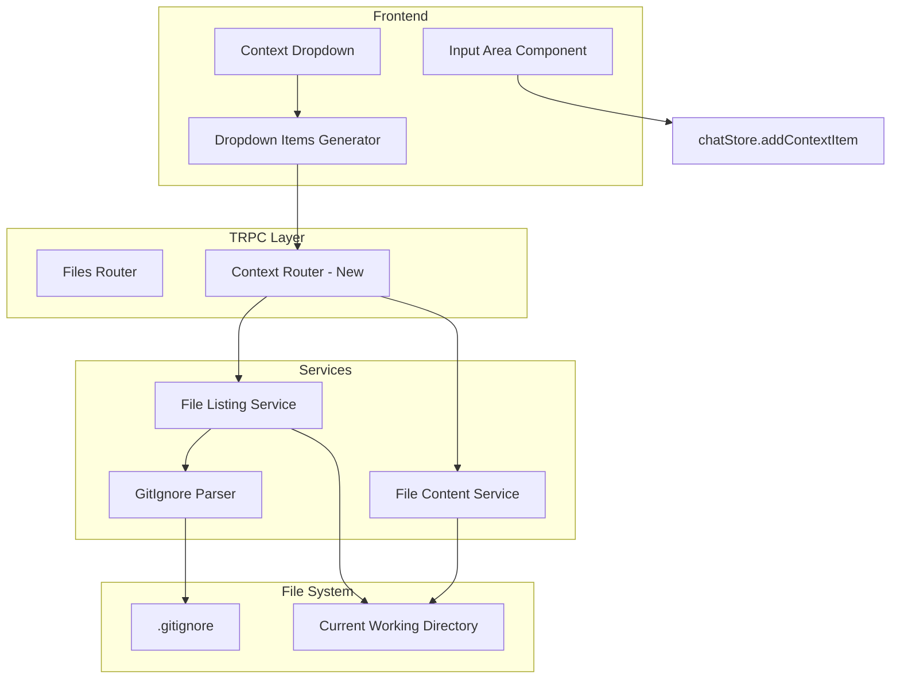
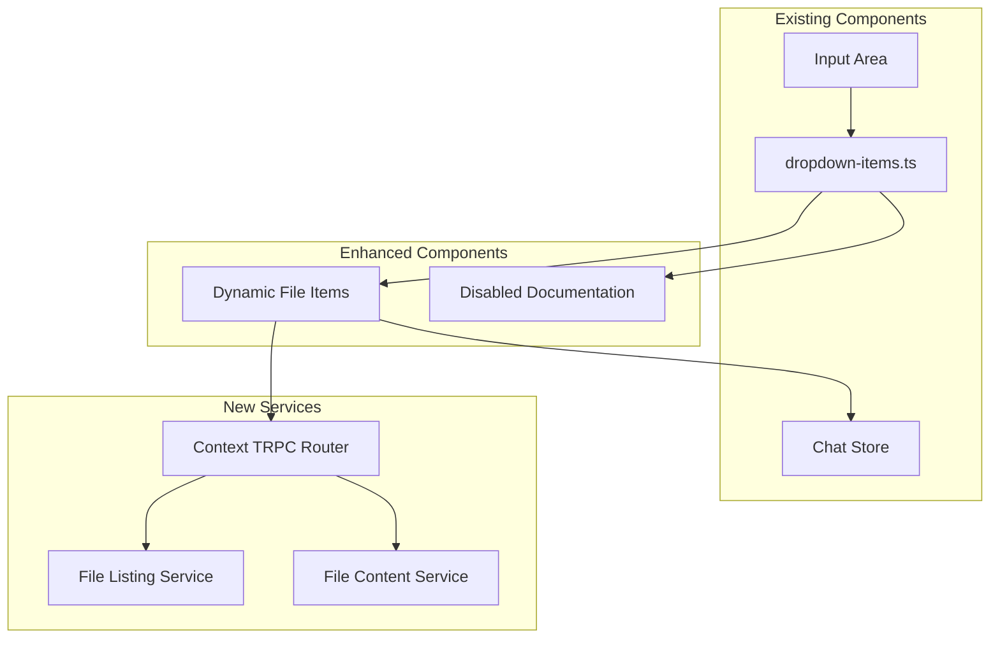

# Design Document

## Overview

This design enhances the existing context dropdown by implementing backend file services that provide actual file data for the Files section and disable the Documentation group. The system leverages the existing dropdown interface and TRPC architecture while adding new file listing and content retrieval capabilities that respect .gitignore rules. The implementation reuses existing patterns from the files router and integrates seamlessly with the current chatStore.addContextItem workflow.

## Architecture

### High-Level Architecture



### Component Integration



## Components and Interfaces

### TRPC Router Extension

```typescript
// New context router to be added to packages/server/src/api/routes/context.ts
export const contextRouter = router({
  // Get file listing for context dropdown
  getFileList: publicProcedure
    .input(
      z.object({
        maxDepth: z.number().optional().default(3),
        includeHidden: z.boolean().optional().default(false),
      })
    )
    .query(async ({ input }) => {
      // Implementation will use FileListingService
    }),

  // Get file content for context
  getFileContent: publicProcedure
    .input(
      z.object({
        filePath: z.string().min(1),
      })
    )
    .query(async ({ input }) => {
      // Implementation will use FileContentService
    }),
});
```

### Service Interfaces

```typescript
// File listing service interface
interface FileListingService {
  listFiles(options: {
    maxDepth?: number;
    includeHidden?: boolean;
    workingDirectory?: string;
  }): Promise<FileSystemEntry[]>;
}

// File content service interface  
interface FileContentService {
  getFileContent(filePath: string): Promise<{
    content: string;
    mimeType: string;
    isBinary: boolean;
    size: number;
  }>;
}

// Enhanced file system entry for context dropdown
interface ContextFileEntry {
  name: string;
  path: string;
  type: "file" | "directory";
  size?: number;
  mimeType?: string;
  isGitIgnored: boolean;
  children?: ContextFileEntry[];
}
```

### Frontend Integration

```typescript
// Enhanced dropdown items generator
export const createDropdownItems = (
  startElementSelection: () => void,
  triggerFileUpload: () => void,
  onAddContext: (item: InputContextItem) => void,
  runnerProcesses?: Record<string, RunnerProcess>,
  fileList?: ContextFileEntry[] // New parameter
): DropdownItem[] => {
  return [
    // Dynamic file items from actual file system
    ...(fileList ? createFileItems(fileList, onAddContext) : []),
    
    // Documentation section - disabled/hidden
    // (removed from items array)
    
    // Existing terminal items
    ...(runnerProcesses ? createTerminalItems(runnerProcesses, onAddContext) : []),
    
    // Existing actions
    {
      id: "select-element",
      label: "Select Element", 
      type: "Actions",
      section: "Actions",
      action: startElementSelection,
    },
    {
      id: "upload",
      label: "Upload File...",
      type: "Actions", 
      section: "Actions",
      action: triggerFileUpload,
    },
  ];
};

// New helper function to create file items
const createFileItems = (
  files: ContextFileEntry[],
  onAddContext: (item: InputContextItem) => void
): DropdownItem[] => {
  const fileItems: DropdownItem[] = [];
  
  const processFiles = (files: ContextFileEntry[], depth = 0) => {
    files.forEach((file) => {
      if (file.type === "file" && !file.isGitIgnored) {
        fileItems.push({
          id: `file-${file.path}`,
          label: `${"  ".repeat(depth)}${file.name}`,
          type: "File",
          section: "Files",
          action: async () => {
            // Fetch file content and add to context
            const content = await trpc.context.getFileContent.query({
              filePath: file.path
            });
            
            onAddContext({
              name: file.name,
              type: "File",
              data: content.content,
              mimeType: content.mimeType,
              isBinary: content.isBinary,
            });
          },
          metadata: {
            path: file.path,
            size: file.size,
            mimeType: file.mimeType,
          },
        });
      }
      
      if (file.children && depth < 2) { // Limit nesting depth
        processFiles(file.children, depth + 1);
      }
    });
  };
  
  processFiles(files);
  return fileItems;
};
```

## Data Models

### File System Entry Model

```typescript
interface ContextFileEntry {
  name: string;
  path: string; // Relative path from working directory
  type: "file" | "directory";
  size?: number; // File size in bytes
  mimeType?: string; // MIME type for files
  isGitIgnored: boolean; // Whether file/directory is in .gitignore
  lastModified?: Date; // Last modification time
  children?: ContextFileEntry[]; // For directories
}
```

### Context Item Enhancement

```typescript
// The existing ContextItem and InputContextItem types already support
// the required fields for file content:
interface InputContextItem {
  name: string;
  type: string;
  data?: unknown; // File content will go here
  mimeType?: string; // MIME type
  isBinary?: boolean; // Binary flag
}
```

### Service Response Models

```typescript
interface FileListResponse {
  files: ContextFileEntry[];
  totalCount: number;
  gitIgnoreRules: string[];
}

interface FileContentResponse {
  content: string; // Text content or base64 for binary
  mimeType: string;
  isBinary: boolean;
  size: number;
  encoding: string; // 'utf-8' or 'base64'
}
```

## Error Handling

### Error Types and Strategies

```typescript
enum ContextFileError {
  FILE_NOT_FOUND = 'file_not_found',
  PERMISSION_DENIED = 'permission_denied', 
  FILE_TOO_LARGE = 'file_too_large',
  BINARY_FILE = 'binary_file',
  GITIGNORE_PARSE_ERROR = 'gitignore_parse_error',
  DIRECTORY_READ_ERROR = 'directory_read_error'
}

interface ContextFileErrorResponse {
  error: ContextFileError;
  message: string;
  filePath?: string;
  details?: any;
}

// Error handling in services
class FileListingService {
  async listFiles(options: FileListingOptions): Promise<FileListResponse> {
    try {
      // Implementation
    } catch (error) {
      if (error.code === 'ENOENT') {
        throw new TRPCError({
          code: 'NOT_FOUND',
          message: 'Working directory not found',
        });
      }
      if (error.code === 'EACCES') {
        throw new TRPCError({
          code: 'FORBIDDEN', 
          message: 'Permission denied reading directory',
        });
      }
      throw new TRPCError({
        code: 'INTERNAL_SERVER_ERROR',
        message: 'Failed to list files',
      });
    }
  }
}
```

### Frontend Error Handling

```typescript
// Error handling in dropdown items
const createFileItems = (
  files: ContextFileEntry[],
  onAddContext: (item: InputContextItem) => void
): DropdownItem[] => {
  // ... existing code ...
  
  action: async () => {
    try {
      const content = await trpc.context.getFileContent.query({
        filePath: file.path
      });
      
      onAddContext({
        name: file.name,
        type: "File", 
        data: content.content,
        mimeType: content.mimeType,
        isBinary: content.isBinary,
      });
    } catch (error) {
      // Show user-friendly error message
      console.error(`Failed to load file ${file.name}:`, error);
      // Could integrate with existing toast/notification system
    }
  }
};
```

## Testing Strategy

### Unit Testing

```typescript
// Service tests
describe('FileListingService', () => {
  test('should list files excluding .gitignore patterns');
  test('should respect maxDepth parameter');
  test('should handle missing .gitignore gracefully');
  test('should exclude hidden files when includeHidden is false');
  test('should handle permission errors gracefully');
});

describe('FileContentService', () => {
  test('should read text file content correctly');
  test('should detect binary files and return base64');
  test('should return correct MIME types');
  test('should handle file not found errors');
  test('should respect file size limits');
});

// TRPC router tests
describe('Context Router', () => {
  test('should return file list with correct structure');
  test('should return file content with metadata');
  test('should handle invalid file paths');
  test('should respect gitignore rules');
});
```

### Integration Testing

```typescript
// Frontend integration tests
describe('Context Dropdown Files Integration', () => {
  test('should load actual files in dropdown');
  test('should add file content to context when selected');
  test('should disable documentation section');
  test('should handle file loading errors gracefully');
  test('should integrate with existing chatStore.addContextItem');
});

// End-to-end tests
describe('File Context E2E', () => {
  test('should complete full file selection workflow');
  test('should respect .gitignore rules in file listing');
  test('should handle large files appropriately');
  test('should work with nested directory structures');
});
```

## Implementation Notes

### GitIgnore Integration

```typescript
// GitIgnore parsing utility
import ignore from 'ignore';

class GitIgnoreService {
  private ignoreInstance: ReturnType<typeof ignore>;
  
  constructor(workingDirectory: string) {
    this.ignoreInstance = ignore();
    this.loadGitIgnoreRules(workingDirectory);
  }
  
  private async loadGitIgnoreRules(workingDirectory: string) {
    try {
      const gitIgnorePath = path.join(workingDirectory, '.gitignore');
      const gitIgnoreContent = await fs.readFile(gitIgnorePath, 'utf-8');
      this.ignoreInstance.add(gitIgnoreContent);
    } catch (error) {
      // .gitignore doesn't exist or can't be read - continue without rules
      console.log('No .gitignore found or unable to read');
    }
  }
  
  isIgnored(filePath: string): boolean {
    return this.ignoreInstance.ignores(filePath);
  }
}
```

### Performance Considerations

1. **File Listing Caching**: Cache file listings for a short period to avoid repeated filesystem scans
2. **Lazy Loading**: Load directory contents on-demand rather than scanning entire tree
3. **Size Limits**: Implement reasonable file size limits for content loading
4. **Debouncing**: Debounce file system operations to avoid excessive API calls

### File Type Detection

```typescript
// MIME type detection utility
import mime from 'mime-types';

class FileTypeService {
  static getMimeType(filePath: string): string {
    return mime.lookup(filePath) || 'application/octet-stream';
  }
  
  static isBinary(content: Buffer): boolean {
    // Simple binary detection - check for null bytes
    return content.includes(0);
  }
  
  static isTextFile(mimeType: string): boolean {
    return mimeType.startsWith('text/') || 
           mimeType === 'application/json' ||
           mimeType === 'application/xml' ||
           mimeType.includes('javascript') ||
           mimeType.includes('typescript');
  }
}
```

### Security Considerations (Local Development)

Since this is for local development only, security measures are minimal:

1. **Path Validation**: Basic validation to ensure paths are relative and don't contain dangerous patterns
2. **File Size Limits**: Reasonable limits to prevent memory issues with very large files
3. **Error Logging**: Log errors for debugging without exposing sensitive information

### Integration with Existing Systems

1. **TRPC Integration**: Follow existing TRPC patterns from files router and settings router
2. **Chat Store Integration**: Use existing chatStore.addContextItem method without modifications
3. **UI Integration**: Enhance existing dropdown-items.ts without breaking existing functionality
4. **Error Handling**: Use existing error handling patterns and logging utilities

### File Content Handling

```typescript
// File content processing
class FileContentProcessor {
  static async processFileContent(filePath: string): Promise<FileContentResponse> {
    const stats = await fs.stat(filePath);
    const mimeType = FileTypeService.getMimeType(filePath);
    
    // Handle large files
    if (stats.size > MAX_FILE_SIZE) {
      throw new Error(`File too large: ${stats.size} bytes`);
    }
    
    const buffer = await fs.readFile(filePath);
    const isBinary = FileTypeService.isBinary(buffer);
    
    return {
      content: isBinary ? buffer.toString('base64') : buffer.toString('utf-8'),
      mimeType,
      isBinary,
      size: stats.size,
      encoding: isBinary ? 'base64' : 'utf-8',
    };
  }
}
```

This design provides a comprehensive approach to enhancing the context dropdown with actual file data while maintaining compatibility with existing systems and following established patterns in the codebase.