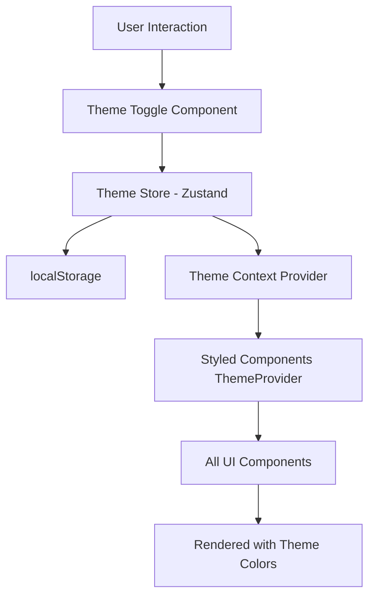

# Dark Theme Design Document

## Overview

This design implements a comprehensive dark theme system for the application, building upon the existing theme infrastructure. The solution uses a combination of React Context, Zustand state management, styled-components theming, and localStorage persistence to provide a seamless theme switching experience. The design follows the existing architectural patterns in the codebase and integrates naturally with the current UI components.

## Architecture

### High-Level Architecture



### Component Hierarchy

1. **Theme Store (Zustand)**: Manages theme state and persistence
2. **Theme Context Provider**: Wraps the application and provides theme values
3. **Styled Components ThemeProvider**: Injects theme into styled-components
4. **Theme Toggle Component**: UI control for switching themes
5. **Settings Integration**: Theme toggle in settings panel

## Components and Interfaces

### 1. Theme Store (theme-store.ts)

A Zustand store that manages theme state with localStorage persistence.

```typescript
interface ThemeState {
  // Current theme mode
  theme: 'light' | 'dark';
  
  // Actions
  setTheme: (theme: 'light' | 'dark') => void;
  toggleTheme: () => void;
}
```

**Key Features:**
- Persists theme preference to localStorage
- Provides theme state to all components
- Handles theme switching logic
- Integrates with Zustand devtools for debugging

### 2. Theme Definitions (theme.tsx)

Extended theme object with both light and dark color palettes.

```typescript
interface ThemeColors {
  primary: string;
  primaryLight: string;
  primaryHover: string;
  primaryActive: string;
  secondary: string;
  secondaryHover: string;
  secondaryActive: string;
  background: string;
  backgroundSecondary: string;
  backgroundTertiary: string;
  text: string;
  textSecondary: string;
  textTertiary: string;
  border: string;
  borderHover: string;
  error: string;
  errorHover: string;
  errorLight: string;
  success: string;
  warning: string;
  info: string;
  highlight: string;
  shadow: string;
  // ... other color properties
}

interface Theme {
  colors: ThemeColors;
  // ... existing theme properties
}

const lightTheme: Theme;
const darkTheme: Theme;
```

**Dark Theme Color Palette:**
- Background: `#1a1a1a` (primary), `#2a2a2a` (secondary), `#333333` (tertiary)
- Text: `#e5e5e5` (primary), `#a0a0a0` (secondary), `#808080` (tertiary)
- Primary: `#3b82f6` (adjusted for dark backgrounds)
- Borders: `#404040` (subtle), `#505050` (hover)
- Shadows: Adjusted opacity for dark backgrounds
- Success: `#22c55e`, Error: `#ef4444`, Warning: `#f59e0b`

### 3. Theme Provider Component (theme-provider.tsx)

Wraps the application and provides theme context to all components.

```typescript
interface ThemeProviderProps {
  children: ReactNode;
}

export const AppThemeProvider: React.FC<ThemeProviderProps>
```

**Responsibilities:**
- Subscribes to theme store
- Selects appropriate theme object (light/dark)
- Wraps children with styled-components ThemeProvider
- Applies CSS transitions for smooth theme changes

### 4. Theme Toggle Component (theme-toggle.tsx)

A reusable toggle component for switching themes.

```typescript
interface ThemeToggleProps {
  variant?: 'switch' | 'icon';
  showLabel?: boolean;
}

export const ThemeToggle: React.FC<ThemeToggleProps>
```

**Features:**
- Switch variant: Toggle switch UI (for settings)
- Icon variant: Sun/moon icon button (for toolbar)
- Visual feedback on theme change
- Accessible with proper ARIA labels

### 5. Settings Integration

Update the existing `settings-view.tsx` to include theme toggle in the General section.

**Changes:**
- Add theme toggle control to the "theme" setting item
- Connect toggle to theme store
- Show current theme state
- Provide immediate visual feedback

## Data Models

### Theme Store State

```typescript
{
  theme: 'light' | 'dark',
  // Persisted to localStorage as 'app-theme-storage'
}
```

### Theme Object Structure

```typescript
{
  colors: {
    // 30+ color properties for comprehensive theming
  },
  spacing: { /* unchanged */ },
  borderRadius: { /* unchanged */ },
  shadows: {
    // Adjusted for dark theme
  },
  typography: { /* unchanged */ },
  zIndices: { /* unchanged */ },
  breakpoints: { /* unchanged */ },
  transitions: {
    // Add theme transition
    theme: '300ms ease-in-out'
  }
}
```

## Error Handling

### localStorage Errors

**Scenario**: localStorage is unavailable or quota exceeded

**Handling**:
- Catch errors during persistence
- Fall back to in-memory state only
- Log warning to console
- Continue with default theme

### Theme Loading Errors

**Scenario**: Invalid theme value in localStorage

**Handling**:
- Validate theme value on load
- Default to 'light' if invalid
- Clear invalid value from storage

### Component Rendering Errors

**Scenario**: Theme context not available

**Handling**:
- Provide helpful error message
- Suggest wrapping with ThemeProvider
- Fail gracefully with default theme

## Testing Strategy

### Unit Tests

1. **Theme Store Tests**
   - Test theme switching
   - Test localStorage persistence
   - Test default theme selection
   - Test toggle functionality

2. **Theme Provider Tests**
   - Test theme object selection
   - Test context provision
   - Test re-rendering on theme change

3. **Theme Toggle Tests**
   - Test click interactions
   - Test visual state updates
   - Test accessibility attributes

### Integration Tests

1. **Settings Integration**
   - Test theme toggle in settings panel
   - Test persistence across page reloads
   - Test theme application to all components

2. **Component Theming**
   - Test styled-components receive correct theme
   - Test color values update on theme change
   - Test transitions are smooth

### Visual Regression Tests

1. **Theme Consistency**
   - Capture screenshots of key pages in both themes
   - Verify color contrast ratios (WCAG AA)
   - Check component visual hierarchy

## Implementation Details

### File Structure

```
packages/frontend/core/src/stores/
  └── theme-store.ts (new)

packages/frontend/design-system/src/theme/
  ├── theme.tsx (modified - add dark theme)
  ├── theme-provider.tsx (new)
  └── index.ts (modified - export new components)

packages/frontend/design-system/src/molecules/
  └── theme-toggle.tsx (new)

packages/frontend/design-system/src/organisms/
  └── settings-view.tsx (modified - integrate theme toggle)
```

### Styled Components Integration

All existing styled-components will automatically support dark theme by accessing theme values:

```typescript
const Button = styled.button`
  background-color: ${props => props.theme.colors.primary};
  color: ${props => props.theme.colors.text};
  border: 1px solid ${props => props.theme.colors.border};
  transition: all ${props => props.theme.transitions.theme};
`;
```

### CSS Transitions

Apply global transition for smooth theme changes:

```typescript
const GlobalThemeStyles = createGlobalStyle`
  * {
    transition: background-color ${props => props.theme.transitions.theme},
                color ${props => props.theme.transitions.theme},
                border-color ${props => props.theme.transitions.theme},
                box-shadow ${props => props.theme.transitions.theme};
  }
`;
```

### Accessibility Considerations

1. **Color Contrast**: All dark theme colors meet WCAG AA standards (4.5:1 for normal text, 3:1 for large text)
2. **Focus Indicators**: Maintain visible focus indicators in both themes
3. **ARIA Labels**: Theme toggle has proper aria-label and role attributes
4. **Keyboard Navigation**: Theme toggle is fully keyboard accessible

### Performance Considerations

1. **Memoization**: Theme object is memoized to prevent unnecessary re-renders
2. **Lazy Loading**: Theme toggle component can be code-split if needed
3. **Transition Performance**: Use CSS transitions (GPU-accelerated) instead of JavaScript animations
4. **localStorage**: Async operations don't block rendering

## Design Decisions and Rationales

### Decision 1: Zustand for Theme State

**Rationale**: 
- Consistent with existing state management (models-store, ui-store)
- Built-in persistence middleware
- Minimal boilerplate
- Easy to test

**Alternative Considered**: React Context only
- Would require more boilerplate for persistence
- Less consistent with existing patterns

### Decision 2: Separate Light and Dark Theme Objects

**Rationale**:
- Clear separation of concerns
- Easy to maintain and update colors
- Type-safe theme values
- Better IDE autocomplete

**Alternative Considered**: Dynamic color calculation
- More complex implementation
- Harder to fine-tune specific colors
- Potential performance overhead

### Decision 3: CSS Transitions for Theme Changes

**Rationale**:
- Smooth, polished user experience
- GPU-accelerated performance
- Simple implementation
- Works automatically with styled-components

**Alternative Considered**: Instant theme change
- Less polished UX
- Jarring visual change

### Decision 4: Theme Toggle in Settings

**Rationale**:
- Consistent with existing settings pattern
- Discoverable location
- Grouped with other appearance settings
- Can be expanded with more theme options later

**Alternative Considered**: Toolbar button
- Less discoverable
- Clutters toolbar
- Can still be added later if needed

## Future Enhancements

1. **System Theme Detection**: Auto-detect OS theme preference
2. **Custom Themes**: Allow users to create custom color schemes
3. **Theme Scheduling**: Auto-switch based on time of day
4. **High Contrast Mode**: Additional theme for accessibility
5. **Theme Presets**: Multiple dark theme variants (blue, purple, etc.)
