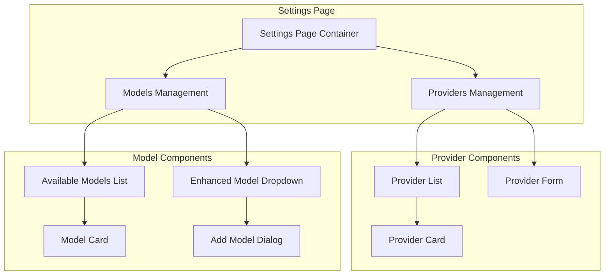

# Design Document

## Overview

This design implements a comprehensive web interface for managing application settings, specifically focusing on AI provider and model management. The system introduces a new workflow where users must explicitly enable models before they can be used, with all configuration stored in global settings using the @chara/settings package. The design leverages the existing architecture with the agents service providing model information and the web interface providing user interaction.

## Architecture

### High-Level Architecture

```mermaid
graph TB
    subgraph "Web Interface"
        UI[Settings UI Components]
        Store[Settings Store/State]
    end
    
    subgraph "Server Layer"
        TRPC[TRPC Router]
        Service[Settings Service]
    end
    
    subgraph "Data Layer"
        Settings[@chara/settings]
        Agents[Agents Service]
    end
    
    UI --> Store
    Store --> TRPC
    TRPC --> Service
    Service --> Settings
    Service --> Agents
    
    Settings --> GlobalConfig[Global Config File]
    Agents --> ModelsService[Models Controller]
```

### Component Architecture



## Components and Interfaces

### Core Data Models

```typescript
// Provider Configuration Interface
interface ProviderConfig {
  id: string;
  name: string;
  type: 'openai' | 'anthropic' | 'google' | 'dial' | 'openrouter' | 'deepseek' | 'moonshot' | 'custom';
  enabled: boolean;
  configuration: Record<string, any>;
  requiredFields: string[];
  createdAt: Date;
  updatedAt: Date;
}

// Enhanced Model Configuration (extends @chara/settings ModelConfig)
interface EnhancedModelConfig extends ModelConfig {
  enabled: boolean;
  providerEnabled: boolean;
  lastUsed?: Date;
}

// Settings State Interface
interface SettingsState {
  providers: ProviderConfig[];
  enabledModels: string[];
  availableModels: ModelConfig[];
  loading: boolean;
  error: string | null;
}

// Provider Form Configuration
interface ProviderFormConfig {
  type: string;
  fields: {
    name: string;
    type: 'text' | 'password' | 'url' | 'number';
    required: boolean;
    placeholder?: string;
    validation?: (value: string) => string | null;
  }[];
}
```

### TRPC Endpoints

```typescript
// Settings TRPC Router from @chara-codes/server
interface SettingsTRPCRouter {
  // Provider Management
  providers: {
    list: () => Promise<ProviderConfig[]>;
    create: (input: { provider: Omit<ProviderConfig, 'id' | 'createdAt' | 'updatedAt'> }) => Promise<ProviderConfig>;
    update: (input: { id: string; updates: Partial<ProviderConfig> }) => Promise<ProviderConfig>;
    delete: (input: { id: string }) => Promise<void>;
    getByType: (input: { type: string }) => Promise<ProviderConfig[]>;
  };
  
  // Model Management
  models: {
    getAvailable: () => Promise<ModelConfig[]>;
    getEnabled: () => Promise<string[]>;
    enable: (input: { modelId: string }) => Promise<void>;
    disable: (input: { modelId: string }) => Promise<void>;
    getByProvider: (input: { provider: string }) => Promise<ModelConfig[]>;
  };
  
  // Configuration
  config: {
    get: () => Promise<any>;
    update: (input: { config: any }) => Promise<void>;
  };
}
```

### React Components

#### Settings Page Container
```typescript
interface SettingsPageProps {
  initialTab?: 'providers' | 'models';
}

const SettingsPage: React.FC<SettingsPageProps> = ({ initialTab = 'providers' }) => {
  // Main container component that manages overall settings state
  // Includes tab navigation between providers and models sections
  // Handles global loading states and error handling
};
```

#### Provider Management Components
```typescript
interface ProviderListProps {
  providers: ProviderConfig[];
  onEdit: (provider: ProviderConfig) => void;
  onDelete: (providerId: string) => void;
  onToggleEnabled: (providerId: string, enabled: boolean) => void;
}

interface ProviderFormProps {
  provider?: ProviderConfig;
  providerType: string;
  onSubmit: (provider: Omit<ProviderConfig, 'id' | 'createdAt' | 'updatedAt'>) => void;
  onCancel: () => void;
}

interface ProviderCardProps {
  provider: ProviderConfig;
  onEdit: () => void;
  onDelete: () => void;
  onToggleEnabled: (enabled: boolean) => void;
}
```

#### Model Management Components
```typescript
interface ModelListProps {
  models: EnhancedModelConfig[];
  onToggleEnabled: (modelId: string, enabled: boolean) => void;
  groupBy?: 'provider' | 'status' | 'none';
}

interface ModelCardProps {
  model: EnhancedModelConfig;
  onToggleEnabled: (enabled: boolean) => void;
}

interface EnhancedModelDropdownProps {
  selectedModel?: string;
  onModelSelect: (modelId: string) => void;
  onAddModel: () => void;
}

interface AddModelDialogProps {
  open: boolean;
  onClose: () => void;
  onModelSelect: (modelId: string) => void;
  availableModels: ModelConfig[];
}
```

## Data Models

### Global Settings Schema

The global settings will be extended to include provider and enabled models configuration:

```typescript
interface GlobalSettings {
  // Existing settings...
  models?: {
    whitelist?: ModelConfig[];
    customModels?: ModelConfig[];
    enabled?: string[]; // New: List of enabled model IDs
  };
  providers?: {
    [providerId: string]: ProviderConfig; // New: Provider configurations
  };
}
```

### Provider Configuration Schema

```typescript
interface ProviderConfig {
  id: string;
  name: string;
  type: 'openai' | 'anthropic' | 'google' | 'dial' | 'openrouter' | 'deepseek' | 'moonshot' | 'custom';
  enabled: boolean;
  configuration: {
    apiKey?: string;
    baseUrl?: string;
    organizationId?: string;
    projectId?: string;
    [key: string]: any;
  };
  requiredFields: string[];
  createdAt: Date;
  updatedAt: Date;
}
```

### Provider Type Definitions

```typescript
const PROVIDER_CONFIGS: Record<string, ProviderFormConfig> = {
  openai: {
    type: 'openai',
    fields: [
      { name: 'apiKey', type: 'password', required: true, placeholder: 'sk-...' },
      { name: 'organizationId', type: 'text', required: false, placeholder: 'org-...' },
      { name: 'projectId', type: 'text', required: false, placeholder: 'proj_...' }
    ]
  },
  anthropic: {
    type: 'anthropic',
    fields: [
      { name: 'apiKey', type: 'password', required: true, placeholder: 'sk-ant-...' }
    ]
  },
  google: {
    type: 'google',
    fields: [
      { name: 'apiKey', type: 'password', required: true, placeholder: 'AI...' }
    ]
  },
  dial: {
    type: 'dial',
    fields: [
      { name: 'baseUrl', type: 'url', required: true, placeholder: 'https://dial.example.com' },
      { name: 'apiKey', type: 'password', required: true, placeholder: 'Bearer token' }
    ]
  },
  custom: {
    type: 'custom',
    fields: [
      { name: 'baseUrl', type: 'url', required: true, placeholder: 'https://api.example.com' },
      { name: 'apiKey', type: 'password', required: true, placeholder: 'API Key' }
    ]
  }
};
```

## Error Handling

### Error Types and Handling Strategy

```typescript
enum SettingsErrorType {
  VALIDATION_ERROR = 'validation_error',
  NETWORK_ERROR = 'network_error',
  PROVIDER_CONFIG_ERROR = 'provider_config_error',
  MODEL_ENABLE_ERROR = 'model_enable_error',
  SETTINGS_SAVE_ERROR = 'settings_save_error'
}

interface SettingsError {
  type: SettingsErrorType;
  message: string;
  field?: string;
  details?: any;
}

class SettingsErrorHandler {
  static handleProviderValidation(provider: ProviderConfig): SettingsError[] {
    // Validate provider configuration based on type
    // Return array of validation errors
  }
  
  static handleModelEnableError(modelId: string, error: any): SettingsError {
    // Handle model enabling errors
    // Check if provider is configured, model exists, etc.
  }
  
  static handleNetworkError(error: any): SettingsError {
    // Handle API communication errors
    // Provide user-friendly messages for common network issues
  }
}
```

### Validation Rules

```typescript
const ValidationRules = {
  provider: {
    name: (value: string) => value.length >= 2 ? null : 'Name must be at least 2 characters',
    apiKey: (value: string, type: string) => {
      if (!value) return 'API Key is required';
      if (type === 'openai' && !value.startsWith('sk-')) return 'OpenAI API key should start with sk-';
      if (type === 'anthropic' && !value.startsWith('sk-ant-')) return 'Anthropic API key should start with sk-ant-';
      return null;
    },
    baseUrl: (value: string) => {
      try {
        new URL(value);
        return null;
      } catch {
        return 'Please enter a valid URL';
      }
    }
  }
};
```

## Testing Strategy

### Unit Testing Approach

```typescript
// Settings Service Tests
describe('SettingsService', () => {
  test('should read providers from global settings');
  test('should save provider configuration');
  test('should validate provider configuration');
  test('should handle missing settings gracefully');
  test('should enable/disable models correctly');
  test('should sync with @chara/settings properly');
});

// Component Tests
describe('ProviderForm', () => {
  test('should render form fields based on provider type');
  test('should validate required fields');
  test('should submit valid configuration');
  test('should display validation errors');
});

describe('ModelList', () => {
  test('should display available models');
  test('should show enabled/disabled status');
  test('should allow toggling model status');
  test('should group models by provider');
});

describe('EnhancedModelDropdown', () => {
  test('should show only enabled models');
  test('should include "Add model..." option');
  test('should open model selection dialog');
});
```

### Integration Testing

```typescript
// TRPC Integration Tests
describe('Settings TRPC Integration', () => {
  test('should create provider and enable associated models');
  test('should delete provider and disable associated models');
  test('should sync enabled models with dropdown');
  test('should handle concurrent settings updates');
});

// End-to-End Testing
describe('Settings Workflow E2E', () => {
  test('should complete full provider setup workflow');
  test('should enable models and use in chat');
  test('should handle provider configuration errors');
  test('should persist settings across app restarts');
});
```

## Implementation Notes

### State Management Strategy

The settings interface will use a combination of React state and TRPC queries/mutations from @chara-codes/server:

```typescript
// Using TRPC hooks for state management
const useSettingsStore = () => {
  const providersQuery = trpc.settings.providers.list.useQuery();
  const enabledModelsQuery = trpc.settings.models.getEnabled.useQuery();
  const availableModelsQuery = trpc.settings.models.getAvailable.useQuery();
  
  const createProviderMutation = trpc.settings.providers.create.useMutation();
  const enableModelMutation = trpc.settings.models.enable.useMutation();
  const disableModelMutation = trpc.settings.models.disable.useMutation();
  
  return {
    providers: providersQuery.data ?? [],
    enabledModels: enabledModelsQuery.data ?? [],
    availableModels: availableModelsQuery.data ?? [],
    loading: providersQuery.isLoading || enabledModelsQuery.isLoading,
    error: providersQuery.error || enabledModelsQuery.error,
    
    // Actions
    createProvider: createProviderMutation.mutateAsync,
    enableModel: enableModelMutation.mutateAsync,
    disableModel: disableModelMutation.mutateAsync,
  };
};
```

### Performance Considerations

1. **Lazy Loading**: Load available models only when needed
2. **Caching**: Use TRPC's built-in caching for provider configurations and model lists
3. **Debouncing**: Debounce form inputs to avoid excessive TRPC calls
4. **Optimistic Updates**: Update UI immediately, rollback on error

### Security Considerations

1. **API Key Masking**: Display masked API keys in the UI
2. **Secure Storage**: Store sensitive configuration in global settings
3. **Validation**: Validate all inputs on both client and server
4. **Error Messages**: Avoid exposing sensitive information in error messages

### Accessibility Features

1. **Keyboard Navigation**: Full keyboard support for all interactions
2. **Screen Reader Support**: Proper ARIA labels and descriptions
3. **Focus Management**: Logical focus flow through forms and dialogs
4. **Color Contrast**: Ensure sufficient contrast for all UI elements
5. **Error Announcements**: Announce validation errors to screen readers