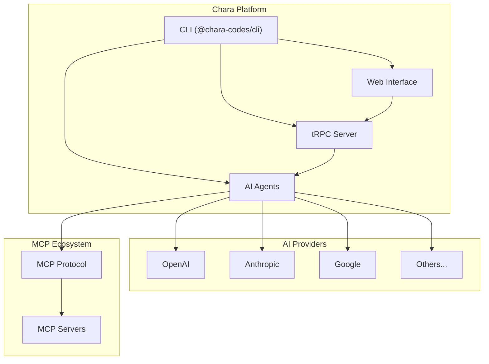

<p align="center">
    
</p>

# Chara Codes

[](https://github.com/chara-codes/chara/actions/workflows/ci.yml)
[](https://badge.fury.io/js/@chara-codes%2Fcli)
[](https://www.npmjs.com/package/@chara-codes%2Fcli)

An AI-powered development environment that brings joy to coding through intelligent assistance, real-time collaboration, and seamless workflow management.

## Table of Contents

- [Introduction](#introduction)
- [Features](#features)
- [Quick Start](#quick-start)
- [Project Structure](#project-structure)
- [Installation](#installation)
- [Architecture](#architecture)
- [Configuration](#configuration)
- [Environment Setup](#environment-setup)
- [AI Widget Mode](#ai-widget-mode)
- [Contributing](#contributing)
- [Documentation](#documentation)
- [Technical Roadmap](#technical-roadmap)
- [License](#license)

## Introduction

Chara Codes is a comprehensive AI-powered development platform designed to streamline modern software development workflows. The name 'chara' (χαρά) means 'joy' in Greek, reflecting our mission to bring joy back to coding through intelligent automation and seamless AI integration.

The platform combines multiple AI providers, Model Context Protocol (MCP) integration, real-time collaboration, and intuitive tooling to create a unified development experience that enhances productivity while maintaining developer control.

## Features

### 🤖 **Multi-Provider AI Integration**
- Support for 9+ AI providers (OpenAI, Anthropic, Google, DeepSeek, Ollama, and more)
- Intelligent context management and streaming responses

### 🛠️ **Comprehensive Tooling**
- Extensible tool system with 15+ built-in tools
- File system operations with security validation
- Terminal execution with real-time streaming
- Code analysis and diagnostics support

### 🌐 **Model Context Protocol (MCP)**
- Full MCP integration for enhanced AI context awareness
- Automatic discovery and connection to MCP servers
- Support for resources, tools, prompts, and sampling

### 💻 **Development Environment**
- Intuitive web interface with split chat/preview panels
- Real-time code editing and preview
- Process management for development servers
- Hot-reload support with tunnel capabilities

### 📡 **Real-Time Communication**
- WebSocket support for live updates
- Event-driven architecture with typed events
- Bidirectional communication between client and server
- Widget mode integration for embedded AI assistance

### 🏃 **Process Management**
- Advanced runner service for long-running processes
- Real-time monitoring and logging
- HTTP endpoint testing and health checks

### 🎯 **AI Widget Mode**
- Embeddable AI coding agent that integrates into any webpage
- Interactive element selection with visual highlighting
- Context-aware assistance based on selected page elements
- Seamless integration with existing development workflows
- Real-time DOM inspection and manipulation capabilities

## Quick Start

### Option 1: Global CLI Installation (Recommended)

```bash
# Install the Chara CLI globally
npm install -g @chara-codes/cli

# Navigate to your project
cd /path/to/your/project

# Start development environment
chara dev
```

The `chara dev` command automatically:
- ✅ Initializes global configuration if needed
- ✅ Sets up AI model selection
- ✅ Creates project configuration
- ✅ Starts all necessary servers
- ✅ Opens web interface at `http://localhost:1237`

### Option 2: Manual Setup

```bash
# Clone the repository
git clone git@github.com:chara-codes/chara.git
cd chara

# Install dependencies
bun install

# Start development servers
bun dev
```

## Project Structure

Chara is organized as a monorepo with the following packages:

```
chara/
├── packages/
│   ├── cli/           # Command-line interface (published as '@chara-codes/cli')
│   ├── server/        # Backend tRPC server with WebSocket support
│   ├── agents/        # AI agents and multi-provider integration
│   ├── web/           # React frontend application
│   ├── widget/        # AI Widget component for web page embedding
│   ├── logger/        # Flexible logging utility with variable dumping
│   ├── tunnel/        # Lightweight tunneling service for local development
│   ├── settings/      # Configuration management for project and global settings
│   └── frontend/      # Frontend core components and design system
│       ├── core/      # Core utilities and shared components
│       └── design-system/ # UI components and design tokens
├── automation/        # End-to-end testing framework
└── docs/             # Documentation and guides
```

### Package Details

#### `@chara-codes/cli`
- **Published as**: `@chara-codes/cli` on npm
- **Purpose**: Development environment management
- **Features**: AI configuration, MCP integration, tunnel support
- **Commands**: `dev`, `init`, `default-model`, `initialize-config`

#### `@chara-codes/server`
- **Purpose**: Backend API and data management
- **Tech**: tRPC, WebSocket, SQLite/LibSQL, Drizzle ORM
- **Features**: Chat management, file operations, real-time events

#### `@chara-codes/agents`
- **Purpose**: AI provider integration and agent orchestration
- **Features**: 9+ AI providers, extensible tools, MCP support
- **Agents**: Chat, Git, Beautify, Initialization agents

#### `@chara-codes/web`
- **Purpose**: Frontend user interface
- **Tech**: React, Styled Components, Vite
- **Features**: Split interface, real-time collaboration, code preview, AI widget mode

#### `@chara-codes/widget`
- **Purpose**: AI Widget component for embedding into web pages
- **Tech**: React, Web Components, Tailwind CSS
- **Features**: Element selection, context-aware assistance, visual highlighting
- **Use Cases**: In-page AI assistance, element inspection, contextual help

#### `@chara-codes/logger`
- **Purpose**: Flexible logging utility with advanced capabilities
- **Features**: Multiple log levels, variable dumping, colorized output, metadata support
- **Use Cases**: Development debugging, application monitoring, data inspection

#### `@chara-codes/tunnel`
- **Purpose**: Lightweight tunneling service for exposing local servers
- **Features**: Custom subdomains, content replacements, WebSocket communication
- **Use Cases**: Local development sharing, webhook testing, demos

#### `@chara-codes/settings`
- **Purpose**: Configuration management utility
- **Features**: Project and global settings management, environment configuration
- **Use Cases**: Configuration persistence, settings synchronization, environment setup

#### `@chara-codes/core`
- **Purpose**: Core utilities and shared components for frontend applications
- **Tech**: React, Zustand, tRPC, TypeScript
- **Features**: Data services, state management, utility functions
- **Use Cases**: Shared frontend logic, state management, API integration

#### `@chara-codes/design-system`
- **Purpose**: Design system components and UI primitives
- **Tech**: React, Radix UI, Tailwind CSS, Class Variance Authority
- **Features**: Accessible components, consistent styling, theme support
- **Use Cases**: UI consistency, component library, design tokens

## Installation

### CLI Installation

```bash
# Stable release
npm install -g @chara-codes/cli

# Alpha release (from playground branch)
npm install -g @chara-codes/cli@alpha

# Local project installation
npm install --save-dev @chara-codes/cli
```

### Development Setup

```bash
# Clone and install
git clone git@github.com:chara-codes/chara.git
cd chara
bun install

# Start all services
bun dev

# Individual package development
cd packages/cli && bun run dev
cd packages/server && bun run dev
cd packages/agents && bun run dev
cd packages/web && bun run dev
```

## Architecture

### System Overview



### Tech Stack

- **Runtime**: Bun (primary), Node.js (compatible)
- **Backend**: tRPC, WebSocket, SQLite/LibSQL, Drizzle ORM
- **Frontend**: React, Styled Components, Vite
- **AI**: AI SDK with multiple provider support
- **Protocol**: Model Context Protocol (MCP)
- **Testing**: Playwright, Visual regression testing

## Configuration

### Global Configuration

Initialize global settings with AI provider credentials:

```bash
chara init
```

Creates `~/.chararc` with all provider environment variables:

```json
{
  "env": {
    "OPENAI_API_KEY": "your_key_here",
    "ANTHROPIC_API_KEY": "your_key_here",
    "GOOGLE_GENERATIVE_AI_API_KEY": "your_key_here"
  },
  "defaultModel": "openai:::gpt-4o"
}
```

### Project Configuration

Create `.chara.json` in your project root:

```json
{
  "host": "localhost",
  "port": 3000,
  "dev": "bun dev",
  "mcpServers": {
    "puppeteer": {
      "command": "npx",
      "args": ["-y", "@modelcontextprotocol/server-puppeteer"]
    },
    "filesystem": {
      "command": "npx",
      "args": ["-y", "@modelcontextprotocol/server-filesystem", "/path/to/project"]
    }
  }
}
```

### Supported AI Providers

- **OpenAI** - GPT-4o, GPT-4, GPT-3.5
- **Anthropic** - Claude 3.5 Sonnet, Claude 3 Opus
- **Google** - Gemini Pro, Gemini Flash
- **DeepSeek** - Chat and reasoning models
- **OpenRouter** - 100+ models through single API
- **Ollama** - Local model execution
- **LM Studio** - Local model serving
- **Moonshot** - Kimi models
- **DIAL** - EPAM AI platform


## Environment Setup

1. **Initialize configuration**:
   ```bash
   chara init
   ```

2. **Set default model**:
   ```bash
   chara default-model
   ```

3. **Start development**:
   ```bash
   chara dev
   ```

### Access Points

- **Web Interface**: `http://localhost:1237`
- **Main Server**: `http://localhost:3030`
- **Agents Server**: `http://localhost:3031`
- **Tunnel Access**: `http://chara.localhost:1337` - AI Widget available only in the mode

## AI Widget Mode

Chara Codes features an innovative AI Widget mode that embeds an intelligent coding assistant directly into web pages, providing contextual AI assistance based on user-selected elements.

### Key Features

- **Element Selection**: Click and select any element on a webpage to provide context to the AI agent
- **Visual Highlighting**: Selected elements are visually highlighted for clear identification
- **Contextual Understanding**: AI agent receives detailed information about selected elements including:
  - DOM structure and hierarchy
  - CSS styles and computed properties
  - Element attributes and data
  - Surrounding context and relationships

### How It Works

1. **Widget Integration**: The AI widget can be embedded into any webpage during development
2. **Element Inspection**: Users can click on page elements to select them as context
3. **AI Analysis**: The agent analyzes selected elements and their properties
4. **Intelligent Assistance**: Provides relevant suggestions, code generation, or debugging help
5. **Real-time Updates**: Changes can be applied and previewed immediately

### Use Cases

- **Design System Integration**: Select components to get styling suggestions or modifications
- **Debugging Assistance**: Select problematic elements to get debugging help and solutions
- **Code Generation**: Select UI elements to generate corresponding code or improvements
- **Accessibility Analysis**: Get accessibility suggestions for selected elements
- **Performance Optimization**: Receive performance recommendations for specific page elements

## Contributing

1. Fork the repository
2. Create a feature branch
3. Add appropriate PR labels
4. Submit a pull request

For detailed guidelines, see [CONTRIBUTING.md](./CONTRIBUTING.md).

## Documentation

### AI & Development
- [AI SDK](https://ai-sdk.dev/)
- [Building Effective Agents](https://www.anthropic.com/engineering/building-effective-agents)
- [Mastra Framework](https://mastra.ai/)

### Model Context Protocol
- [MCP Introduction](https://modelcontextprotocol.io/introduction)
- [MCP Registry](https://mcp.so/)
- [Awesome MCP Servers](https://github.com/punkpeye/awesome-mcp-servers)

### Backend Technologies
- [tRPC](https://trpc.io/)
- [Drizzle ORM](https://orm.drizzle.team/)
- [libsql](https://github.com/tursodatabase/libsql)
- [Bun Runtime](https://bun.sh/docs)

### Testing & Automation
- [Playwright](https://playwright.dev/)
- [Visual Testing](https://playwright.dev/docs/test-snapshots)

## Technical Roadmap

- [x] Multi-provider AI integration
- [x] Model Context Protocol support
- [x] Real-time WebSocket communication
- [x] Comprehensive tooling system
- [x] CLI with automated publishing
- [x] AI Widget mode with element selection
- [ ] Enhanced collaboration features
- [ ] Advanced code analysis
- [ ] Plugin system for extensions
- [ ] Browser exxtension

## License

Apache License 2.0

Copyright (c) 2025 Chara Codes

Licensed under the Apache License, Version 2.0 (the "License");
you may not use this file except in compliance with the License.
You may obtain a copy of the License at

    http://www.apache.org/licenses/LICENSE-2.0

Unless required by applicable law or agreed to in writing, software
distributed under the License is distributed on an "AS IS" BASIS,
WITHOUT WARRANTIES OR CONDITIONS OF ANY KIND, either express or implied.
See the License for the specific language governing permissions and
limitations under the License.
