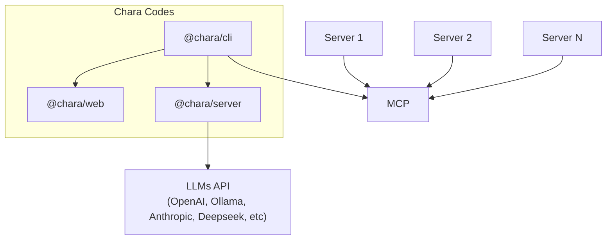

<p align="center">
    
</p>

# Table of Contents
- [Introduction](#introduction)
- [Features](#features)
- [Project Structure](#project-structure)
- [Getting Started](#getting-started)
- [Architecture](#architecture)
- [Configuration](#configuration)
- [Release Management](#release-management)
- [Contributing](#contributing)
- [Documentation](#documentation)
- [Technical depts](#technical-depts)
- [License](#license)

## Introduction

Chara Codes is an AI-powered development environment designed to streamline frontend development workflows. It combines AI assistance with intuitive tools to help developers write, review, and manage code more efficiently. The platform provides real-time AI suggestions, code generation, and project management capabilities through a modern web interface.
In Greek, the word 'chara' (χαρά) means 'joy' or 'happiness'. Chara Codes aims to bring joy to developers by simplifying and enhancing their coding experience.

## Features

- 🤖 AI-powered code generation and suggestions
- 💻 Intuitive split interface with chat and preview panels
- 📝 Real-time code preview and editing
- 🔄 Seamless integration with multiple AI providers
- 🌐 Built-in Model Context Protocol (MCP) support
- 📊 Advanced code visualization and navigation
- 🔍 Smart code analysis and suggestions
- 🖥️ Focus on local environment changes with minimal setup
- 🔌 Support for multiple technology stacks (React, Vue, Angular, etc.)

## Project Structure

The project is organized as a monorepo with the following packages:

- `@chara/web` - Next.js frontend application
  - Split interface for chat and preview
  - Real-time code editing and preview
  - Responsive UI built with Tailwind and shadcn/ui

- `@chara/server` - Backend server application
  - tRPC API with WebSocket support
  - Multiple AI provider integrations
  - SQLite/LibSQL database with Drizzle ORM
  - Streaming response support

- `@chara/cli` - Command-line interface
  - AI-powered development assistant
  - Project setup and configuration
  - MCP server integration
  - Local development server management
  - Published to npm as `chara`

- `./automation` - Testing framework
  - End-to-end testing with Playwright
  - AI-assisted test generation and validation
  - Visual regression testing
  - Streamlined helper patterns
  - Local-remote sync capabilities

## Getting Started

```bash
# Clone the repository
git clone git@github.com:chara-codes/chara.git

# Install dependencies
bun install

# Start development servers
bun dev

# Or install the CLI globally
npm install -g chara
chara dev
```

## Docker Usage

Chara can be deployed using Docker for production environments. The project includes a `docker-compose.yml` configuration that sets up the following services:

- **traefik**: Reverse proxy/load balancer that handles routing, TLS termination, and provides a dashboard
- **charaserver**: Backend server application container
- **charaweb**: Next.js frontend application container
- **charatunnel**: Connection tunnel service for remote access

### Prerequisites

- Docker and Docker Compose installed
- SSL certificates in the `./certs` directory
- Traefik dynamic configuration in `./traefik/dynamic`
- A `config.json` file for the tunnel service

### Running with Docker

```bash
# Build and start all services
docker-compose up -d

# View logs
docker-compose logs -f

# Stop all services
docker-compose down
```

### Configuration

The Docker setup uses Traefik as a reverse proxy with automatic HTTPS redirection and is configured to expose services on these domains:

- `web.chara-ai.dev` - Frontend application
- `server.chara-ai.dev` - Backend API
- `*.chara-ai.dev` - Dynamic tunnel subdomains

You can modify the domain names and other settings in the `docker-compose.yml` file or through Traefik's dynamic configuration.

## Architecture

Chara uses a modern stack with:

- **Frontend**: Next.js, React, TailwindCSS, shadcn/ui
- **Backend**: Bun, tRPC, Drizzle ORM, LibSQL
- **AI**: Multiple provider support through AI SDK
- **Real-time**: WebSocket for live updates
- **CLI**: Bun-powered command line tool

### Architecture Diagram



## Configuration

Each package can be configured independently:

- **Web**: Environment variables for API endpoints and features
- **Server**: `.env` file for database and AI provider settings
- **CLI**: `.chara.json` for project-specific configuration

See individual package READMEs for detailed configuration options.

## CLI Publishing

The Chara CLI is automatically published to npm when changes are made to the `packages/cli` directory:

### Installation

```bash
# Install stable version
npm install -g chara

# Install alpha version (from playground branch)
npm install -g chara@alpha
```

### Publishing Process

- **Main branch**: Stable releases published with `latest` tag
- **Playground branch**: Alpha releases with timestamped versions and `alpha` tag
- **Automated**: GitHub Actions handle building and publishing
- **Manual**: Workflow can be triggered manually from Actions tab

### Version Management

```bash
# Bump version before merging to main
cd packages/cli
bun run version:patch   # or minor, major
bun run version:set 1.2.3
bun run version:current
```

For detailed setup instructions, see [CLI Publishing Guide](./.github/PUBLISHING.md).

## Release Management

Chara uses [Auto](https://github.com/intuit/auto) for automated release management. Releases are triggered by PR labels and happen automatically through GitHub Actions.

### For Contributors

When creating a PR, add one of these labels to determine the release type:

- `💥 Breaking Change` - Major version bump
- `🚀 Feature` - Minor version bump  
- `🐛 Bug Fix` - Patch version bump
- `📚 Documentation` - Patch version bump
- `🏠 Internal` - Patch version bump
- `🏃 Performance` - Patch version bump
- `📦 Dependencies` - Patch version bump
- `🚫 Skip Release` - Skip this PR from releases

### Release Process

- **Main branch**: Production releases happen automatically when PRs are merged
- **Playground branch**: Canary releases for testing new features
- **Feature branches**: Can create canary releases for preview

### Manual Release Commands

```bash
# Check release status
bun run release:check

# Setup GitHub labels (run once)
bun run release:labels

# Create canary release
bun run release:canary

# Ship production release
bun run release
```

For detailed information, see [Release Management Guide](./docs/RELEASES.md) and [Migration Guide](./docs/MIGRATION_TO_AUTO.md).

## Documentation

### AI
 - [AI SDK](https://ai-sdk.dev/)
 - [Building effective agents](https://www.anthropic.com/engineering/building-effective-agents)
 - [Mastra Typescript Agentic Framework](https://mastra.ai/)

#### [Vibe Coding](https://en.wikipedia.org/wiki/Vibe_coding)
 - [Zed editor](https://zed.dev/)
 - [Cursor AI code editor](https://www.cursor.com/)
 - [v0](https://v0.dev/)
 - [bolt.new](https://bolt.new/)

#### MCP
 - [MCP](https://modelcontextprotocol.io/introduction)
 - [MCP Registry](https://mcp.so/)
 - [MCP Registry 1](https://mcp-get.com/)
 - [MCP Registry 2](https://smithery.ai/)
 - [Awesome MCP](https://github.com/punkpeye/awesome-mcp-servers)
 - [Awesome MCP 2](https://github.com/appcypher/awesome-mcp-servers)
 - [MCP SDK](https://github.com/modelcontextprotocol/typescript-sdk)

### Backend (@chara/server)
- [tRPC.io](https://trpc.io/)
- [Drizzle ORM](https://orm.drizzle.team/)
- [libsql](https://github.com/tursodatabase/libsql)
- [Vector DB, AI & Embedings with libsql](https://docs.turso.tech/features/ai-and-embeddings)
- [AI SDK](https://sdk.vercel.ai/docs)
- [Anthropic API](https://docs.anthropic.com/claude/reference/getting-started-with-the-api)
- [OpenAI API](https://platform.openai.com/docs/api-reference)
- [Bun Runtime](https://bun.sh/docs)
- [Streaming with tRPC](https://trpc.io/docs/server/streaming)
- [Ollama Integration](https://github.com/ollama/ollama)

### Automation Testing (@chara/automation)
 - [Playwright](https://playwright.dev/)
 - [AI SDK](https://ai-sdk.dev/)
 - [Visual Testing](https://playwright.dev/docs/test-snapshots)
 - [Test Fixtures](https://playwright.dev/docs/test-fixtures)
 - [React Markdown](https://remarkjs.github.io/react-markdown/)
 - [lucide-react](https://lucide.dev/guide/packages/lucide-react)

### CLI (@chara/cli)
 - [yargs](https://yargs.js.org/)
 - [picocolors](https://github.com/alexeyraspopov/picocolors)
 - [Isomorphic git](https://isomorphic-git.org/)

### Common
 - [bun javascript runtime](https://bun.sh/)
 - [zod](https://zod.dev/)

## Technical depts

 - [x] Implement object streaming in tRPC
 - [ ] Add support for multiple AI providers
 - [ ] Add history and undo/redo functionality
 - [ ] Implement MCP servers integration

## License

MIT License

Copyright (c) 2025 Chara Codes

Permission is hereby granted, free of charge, to any person obtaining a copy of this software and associated documentation files (the "Software"), to deal in the Software without restriction, including without limitation the rights to use, copy, modify, merge, publish, distribute, sublicense, and/or sell copies of the Software, and to permit persons to whom the Software is furnished to do so, subject to the following conditions:

The above copyright notice and this permission notice shall be included in all copies or substantial portions of the Software.
