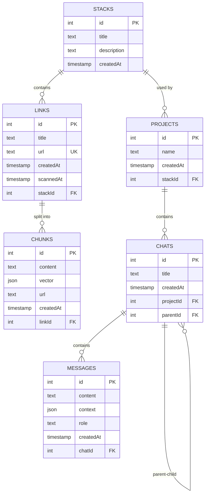

# @chara-codes/server

A modular, configurable backend server for the Chara AI chat application, providing AI-powered chat, code generation, and document management capabilities through a modern tRPC API with a simple function-based configuration approach.

## Features

- **Simple Function-Based API**: Configure and start server with a single `startServer()` function call
- **Modular Architecture**: Configurable server components with optional features
- **tRPC API**: Type-safe API for client-server communication  
- **WebSocket Support**: Real-time communication for chat functionality (optional)
- **MCP Integration**: Model Context Protocol support for advanced AI interactions (optional)
- **AI Integration**: Multiple AI provider support (OpenAI, Anthropic, Azure, etc.)
- **Database Integration**: SQLite/LibSQL database with Drizzle ORM
- **Streaming Responses**: Support for streaming AI responses
- **Typed Events**: Type-safe event emitter system
- **Advanced Logging**: Structured, colored logging system
- **Environment Variable Support**: Automatic loading from environment variables

## Installation

```bash
# From the root of the monorepo
bun install

# Or directly in the server package
cd packages/server
bun install
```

## Configuration

The server uses a simple function-based configuration approach. You can configure the server by:
1. Passing options to the `startServer()` function
2. Setting environment variables (automatically loaded)
3. Using default configuration

### Environment Variables

Create a `.env` file in the `packages/server` directory:

```bash
# Database configuration
DATABASE_URL="file:chara.db"
DATABASE_AUTH_TOKEN=""

# AI provider configuration
AI_KEY="your-api-key"
AI_URL="https://api.openai.com/v1"  # Or other provider URLs
AI_MODEL="gpt-4o-mini"  # Default model to use

# Server configuration
SERVER_PORT=3030
SERVER_CORS_ORIGIN="*"
SERVER_CORS_METHODS="GET, POST, PUT, DELETE, PATCH, OPTIONS"
SERVER_CORS_HEADERS="*"

# WebSocket configuration
WEBSOCKET_ENABLED=true
WEBSOCKET_ENDPOINT="/events"
WEBSOCKET_BATCHING_ENABLED=true

# MCP (Model Context Protocol) configuration
MCP_ENABLED=true
MCP_PORT=3035
MCP_SSE_ENDPOINT="/sse"
MCP_MESSAGES_ENDPOINT="/messages"
MCP_IDLE_TIMEOUT=255

# tRPC configuration
TRPC_ENDPOINT="/trpc"

# Logging configuration
LOGGING_REQUESTS=false
LOGGING_HEADERS=false
```

### Function-Based Configuration

Configure the server by passing options to the `startServer()` function:

```typescript
import { startServer } from '@chara-codes/server';

const { manager, appRouter } = await startServer({
  server: {
    port: 4000,
    cors: {
      origin: "http://localhost:3000",
    },
  },
  websocket: {
    enabled: false, // Disable WebSocket
  },
  mcp: {
    enabled: true,
    port: 4001,
  },
  logging: {
    requests: true,
  },
});
```

### Supported AI Providers

The server automatically detects the AI provider based on the API URL:

- OpenAI: `https://api.openai.com/v1`
- Azure OpenAI: `https://{resource-name}.azure.com/openai`
- Anthropic: `https://api.anthropic.com/v1`
- Cohere: `https://api.cohere.ai/v1`
- Perplexity: `https://api.perplexity.ai/v1`
- Mistral: `https://api.mistral.ai/v1`
- Deepseek: `https://api.deepseek.com/v1`
- Ollama: `http://localhost:11434/v1` or any URL containing "ollama"
- DeepInfra: `https://api.deepinfra.com/v1`

## Local AI Development with Ollama in Docker

### Step 1: Install & Run Ollama in Docker

Base command to run ollama in Docker:

```bash
docker run -d -v ollama:/root/.ollama -p 11434:11434 --name ollama ollama/ollama
```

For further details (e.g. running ollama with GPU), refer to the [Ollama Docker documentation](https://hub.docker.com/r/ollama/ollama).

### Step 2: Pull Models

To pull models, use the following commands:

```bash
docker exec -it ollama bash
ollama pull wizardcoder
```

### Step 3: Use ollama in local development

To use the local ollama instance in your development environment, add the following lines to your `packages/server/.env` file:

```bash
AI_URL="http://localhost:11434/api"
AI_MODEL="wizardcoder"
````

## Database Setup

This project uses Drizzle ORM with SQLite/LibSQL. To set up the database:

```bash
# Generate migrations from schema
bun db:generate

# Push schema changes to the database
bun db:push

# Launch Drizzle Studio for visual database management
bun db:studio
```

## Server Architecture

The server has been refactored into a simple, modular architecture:

### `startServer()` Function

The main entry point that handles all server initialization:

- **Simple API**: Single function call to configure and start the server
- **Automatic Configuration**: Merges provided options with defaults
- **Environment Loading**: Automatically loads configuration from environment variables
- **Validation**: Built-in configuration validation with helpful error messages
- **Type Safety**: Full TypeScript support with configurable options

### Internal Components

- **ServerManager Class**: Internal orchestrator for all server components
- **Configurable Features**: Enable/disable WebSocket, MCP, and other features
- **Multiple Servers**: Manages both the main HTTP/tRPC server and optional MCP server
- **Graceful Shutdown**: Handles proper cleanup of all resources

### Optional Features

#### WebSocket Support (`websocket.enabled`)
- Real-time communication for chat functionality
- Configurable endpoints and batching options
- Can be completely disabled for minimal deployments

#### MCP Integration (`mcp.enabled`)
- Model Context Protocol support for advanced AI interactions
- Separate server instance with SSE transport
- Configurable ports and endpoints
- Independent lifecycle management

### Configuration Options

All configuration is optional and has sensible defaults:

- **Development**: Enable logging and use permissive CORS
- **Production**: Configure specific origins and disable verbose logging
- **Minimal**: Disable WebSocket and MCP for simple API-only usage
- **Custom ports**: Configure different ports for main and MCP servers

## Usage

### Quick Start

```bash
# Start with default configuration
bun run start-server.ts

# Start with environment variables
SERVER_PORT=4000 MCP_ENABLED=false bun run start-server.ts
```

### Custom Server Setup

```typescript
import { startServer } from '@chara-codes/server';

// Basic usage with default configuration
const { manager, appRouter } = await startServer();

// Custom configuration
const { manager, appRouter } = await startServer({
  server: { 
    port: 8080,
    cors: {
      origin: "https://yourdomain.com"
    }
  },
  websocket: { enabled: false },
  mcp: { enabled: true, port: 8081 },
  logging: { requests: true }
});

// Export the router type for client use
export type AppRouter = typeof appRouter;
```

## Database Schema

The Chara server uses a relational database with the following entity structure:

### Entities and Relationships

#### Stacks
The top-level organization unit that collects related links (documents/URLs).
- Contains a title and description
- Acts as a container for related links/documents

#### Links
URL references that belong to stacks.
- Each link points to a document/URL with useful content
- Links are processed into chunks for semantic search
- Links track when they were last scanned/processed

#### Chunks
Segments of content extracted from links.
- Created by splitting document content into smaller pieces
- Each chunk contains a vector embedding for semantic search
- Chunks are used to provide relevant context to AI responses

#### Projects
Working environments created from stacks.
- Each project is based on a specific stack
- Projects organize conversations around a particular set of documents
- Multiple projects can reference the same stack

#### Chats
Conversation instances within projects.
- Each chat belongs to a project
- Chats can be organized hierarchically (with parent-child relationships)
- A project can contain multiple chats on different topics

#### Messages
Individual exchanges within a chat.
- Contains the actual content with context of user questions and AI responses
- Each message has a role (user or assistant)
- Messages maintain conversation history for context

### Relationships

- Stacks contain many Links (one-to-many)
- Links contain many Chunks (one-to-many)
- Stacks can have many Projects (one-to-many)
- Projects contain many Chats (one-to-many)
- Chats contain many Messages (one-to-many)
- Chats can have parent-child relationships (self-referential)

This database design enables the application to:
1. Organize knowledge in collections (stacks)
2. Process and index document content (chunks)
3. Create focused work environments (projects)
4. Maintain conversation context (chats and messages)
5. Perform semantic search across relevant documents

## Usage
### Database Schema Diagram



### Development

Start the development server with hot reloading:

```bash
bun dev
```

For development with custom configuration:

```bash
# Enable detailed logging
LOGGING_REQUESTS=true LOGGING_HEADERS=true bun dev

# Disable MCP for faster startup
MCP_ENABLED=false bun dev

# Custom ports
SERVER_PORT=4000 MCP_PORT=4001 bun dev
```

### Production

Build and start the production server:

```bash
bun build
bun start
```

For production with specific configuration:

```bash
# Override specific settings with environment variables
SERVER_PORT=8080 MCP_ENABLED=false bun start
```

### Testing

Run tests with Vitest:

```bash
bun test
```

## API Endpoints

The server exposes different endpoints based on configuration:

### Main Server (always available)
- `GET|POST /trpc/*`: tRPC HTTP endpoints (configurable endpoint)
- `GET /`: Health check endpoint

### WebSocket Endpoints (if `websocket.enabled`)
- `WS /events`: WebSocket endpoint for real-time communication (configurable endpoint)
- `WS /mcp-tunnel`: MCP tunnel WebSocket endpoint

### MCP Server Endpoints (if `mcp.enabled`)
- `GET /sse`: Server-Sent Events endpoint for MCP (configurable endpoint)
- `POST /messages`: MCP message handling endpoint (configurable endpoint)

All endpoints support CORS and can be customized through configuration.

## Project Structure

The server is structured into the following main components:

- `src/server.ts`: Main ServerManager class and configuration
- `src/start-server.ts`: Server startup script with configuration loading
- `src/config/`: Configuration management utilities and examples
- `src/types/`: TypeScript type definitions
- `src/api/`: tRPC routers and API definitions
- `src/ai/`: AI providers, tools and agents
- `src/db/`: Database schema and utilities
- `src/mcp/`: Model Context Protocol implementation
- `src/utils/`: Utility functions and helpers

### Key Files

- `server.ts`: Core server implementation with `startServer()` function
- `start-server.ts`: Example server startup script

## tRPC Client Example

```typescript
import { createTRPCProxyClient, httpBatchLink } from '@trpc/client';
import type { AppRouter } from '@chara-codes/server';

const client = createTRPCProxyClient<AppRouter>({
  links: [
    httpBatchLink({
      url: 'http://localhost:3030/trpc',
    }),
  ],
});

// Example: Query the API
async function main() {
  const response = await client.messages.ask.query({
    question: "What is Chara?",
  });

  for await (const chunk of response) {
    process.stdout.write(chunk);
  }
}
```

## License

MIT License

Copyright (c) 2025 Chara Codes

This project is licensed under the MIT License - see the main [LICENSE](../../LICENSE) file for details.
