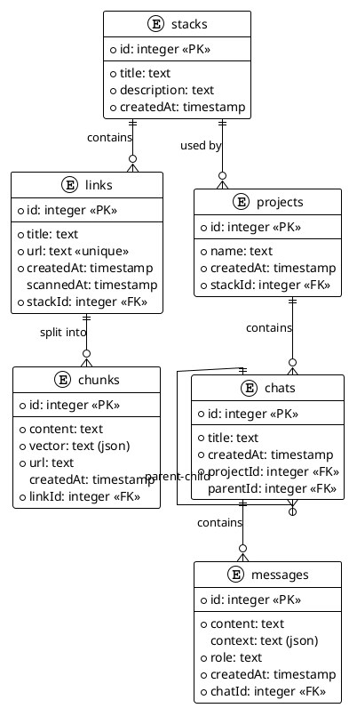

# @chara/server

A backend server for the Chara AI chat application, providing AI-powered chat, code generation, and document management capabilities through a modern tRPC API.

## Features

- **tRPC API**: Type-safe API for client-server communication
- **WebSocket Support**: Real-time communication for chat functionality
- **AI Integration**: Multiple AI provider support (OpenAI, Anthropic, Azure, etc.)
- **Database Integration**: SQLite/LibSQL database with Drizzle ORM
- **Streaming Responses**: Support for streaming AI responses
- **Typed Events**: Type-safe event emitter system
- **Advanced Logging**: Structured, colored logging system

## Installation

```bash
# From the root of the monorepo
bun install

# Or directly in the server package
cd packages/server
bun install
```

## Configuration

Create a `.env` file in the `packages/server` directory with the following variables:

```bash
# Database configuration
DATABASE_URL="file:chara.db"
DATABASE_AUTH_TOKEN=""

# AI provider configuration
AI_KEY="your-api-key"
AI_URL="https://api.openai.com/v1"  # Or other provider URLs
AI_MODEL="gpt-4o-mini"  # Default model to use
```

### Supported AI Providers

The server automatically detects the AI provider based on the API URL:

- OpenAI: `https://api.openai.com/v1`
- Azure OpenAI: `https://{resource-name}.azure.com/openai`
- Anthropic: `https://api.anthropic.com/v1`
- Cohere: `https://api.cohere.ai/v1`
- Perplexity: `https://api.perplexity.ai/v1`
- Mistral: `https://api.mistral.ai/v1`
- Deepseek: `https://api.deepseek.com/v1`
- Ollama: `http://localhost:11434/v1` or any URL containing "ollama"
- DeepInfra: `https://api.deepinfra.com/v1`

## Database Setup

This project uses Drizzle ORM with SQLite/LibSQL. To set up the database:

```bash
# Generate migrations from schema
bun db:generate

# Push schema changes to the database
bun db:push

# Launch Drizzle Studio for visual database management
bun db:studio
```

## Usage

## Database Schema

The Chara server uses a relational database with the following entity structure:

### Entities and Relationships


#### Stacks
The top-level organization unit that collects related links (documents/URLs).
- Contains a title and description
- Acts as a container for related links/documents

#### Links
URL references that belong to stacks.
- Each link points to a document/URL with useful content
- Links are processed into chunks for semantic search
- Links track when they were last scanned/processed

#### Chunks
Segments of content extracted from links.
- Created by splitting document content into smaller pieces
- Each chunk contains a vector embedding for semantic search
- Chunks are used to provide relevant context to AI responses

#### Projects
Working environments created from stacks.
- Each project is based on a specific stack
- Projects organize conversations around a particular set of documents
- Multiple projects can reference the same stack

#### Chats
Conversation instances within projects.
- Each chat belongs to a project
- Chats can be organized hierarchically (with parent-child relationships)
- A project can contain multiple chats on different topics

#### Messages
Individual exchanges within a chat.
- Contains the actual content with context of user questions and AI responses
- Each message has a role (user or assistant)
- Messages maintain conversation history for context

### Relationships

- Stacks contain many Links (one-to-many)
- Links contain many Chunks (one-to-many)
- Stacks can have many Projects (one-to-many)
- Projects contain many Chats (one-to-many)
- Chats contain many Messages (one-to-many)
- Chats can have parent-child relationships (self-referential)

This database design enables the application to:
1. Organize knowledge in collections (stacks)
2. Process and index document content (chunks)
3. Create focused work environments (projects)
4. Maintain conversation context (chats and messages)
5. Perform semantic search across relevant documents

## Usage
### Database Schema Diagram



## Usage

### Development

Start the development server with hot reloading:

```bash
bun dev
```

### Production

Build and start the production server:

```bash
bun build
bun start
```

### Testing

Run tests with Vitest:

```bash
bun test
```

## API Endpoints

The server exposes the following main endpoints:

- `GET /trpc/*`: tRPC HTTP endpoints
- `WS /events`: WebSocket endpoint for real-time communication
- `GET /chat`: Streaming chat responses

## Architecture

The server is structured into the following main components:

- `src/api`: tRPC routers and API definitions
- `src/ai`: AI providers, tools and agents
- `src/db`: Database schema and utilities
- `src/utils`: Utility functions and helpers

## tRPC Client Example

```typescript
import { createTRPCProxyClient, httpBatchLink } from '@trpc/client';
import type { AppRouter } from '@chara/server';

const client = createTRPCProxyClient<AppRouter>({
  links: [
    httpBatchLink({
      url: 'http://localhost:3030/trpc',
    }),
  ],
});

// Example: Query the API
async function main() {
  const response = await client.messages.ask.query({
    question: "What is Chara?",
  });

  for await (const chunk of response) {
    process.stdout.write(chunk);
  }
}
```

## License

MIT License

Copyright (c) 2025 Chara Codes

This project is licensed under the MIT License - see the main [LICENSE](../../LICENSE) file for details.
