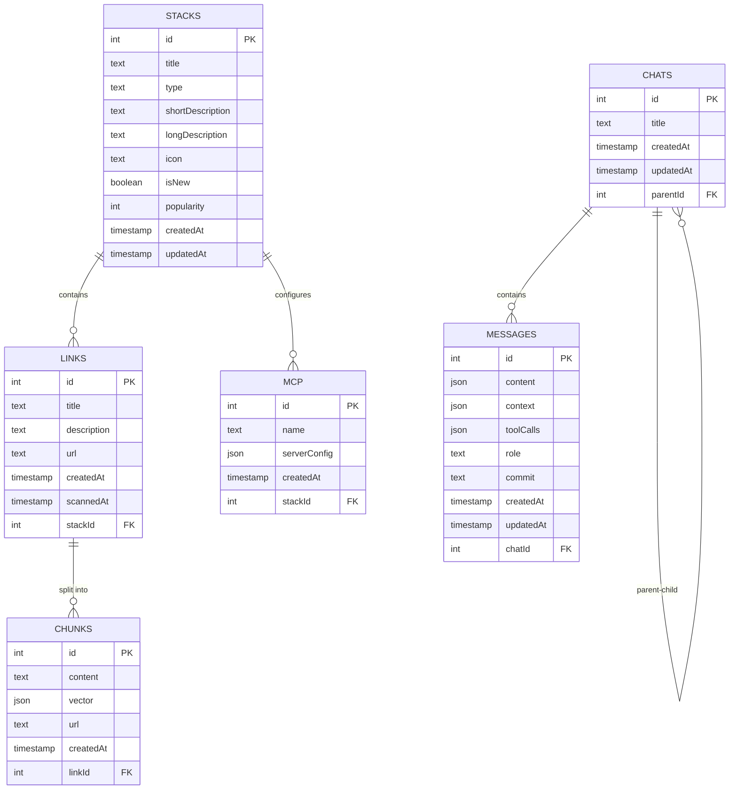

# @chara-codes/server

A modular, configurable backend server for developer tools and knowledge management, providing chat conversations, technology stack organization, and document processing capabilities through a modern tRPC API with Model Context Protocol (MCP) proxy support.

## Features

- **Simple Function-Based API**: Configure and start server with a single `startServer()` function call
- **Modular Architecture**: Configurable server components with optional features
- **tRPC API**: Type-safe API for client-server communication
- **MCP Proxy Server**: Model Context Protocol proxy server for advanced AI interactions (optional)
- **DrizzleORM Integration**: SQLite database with Drizzle ORM for type-safe database operations
- **Typed Events**: Type-safe event emitter system with WebSocket support
- **Advanced Logging**: Structured, colored logging system
- **Environment Variable Support**: Automatic loading from environment variables

## Installation

```bash
# From the root of the monorepo
bun install

# Or directly in the server package
cd packages/server
bun install
```

## Configuration

The server uses a simple function-based configuration approach. You can configure the server by:
1. Passing options to the `startServer()` function
2. Setting environment variables (automatically loaded)
3. Using default configuration

### Environment Variables

Create a `.env` file in the `packages/server` directory:

```bash
# Database configuration
DATABASE_URL="file:.chara/chara.db"
DATABASE_AUTH_TOKEN=""

# Server configuration
SERVER_PORT=3030
SERVER_CORS_ORIGIN="*"
SERVER_CORS_METHODS="GET, POST, PUT, DELETE, PATCH, OPTIONS"
SERVER_CORS_HEADERS="*"

# WebSocket configuration
WEBSOCKET_ENABLED=true
WEBSOCKET_ENDPOINT="/events"
WEBSOCKET_BATCHING_ENABLED=true

# MCP (Model Context Protocol) configuration
MCP_ENABLED=true
MCP_PORT=3035
MCP_SSE_ENDPOINT="/sse"
MCP_MESSAGES_ENDPOINT="/messages"
MCP_IDLE_TIMEOUT=255

# tRPC configuration
TRPC_ENDPOINT="/trpc"

# Logging configuration
LOGGING_REQUESTS=false
LOGGING_HEADERS=false
```

### Function-Based Configuration

Configure the server by passing options to the `startServer()` function:

```typescript
import { startServer } from '@chara-codes/server';

const { manager, appRouter } = await startServer({
  server: {
    port: 4000,
    cors: {
      origin: "http://localhost:3000",
    },
  },
  websocket: {
    enabled: false, // Disable WebSocket
  },
  mcp: {
    enabled: true,
    port: 4001,
  },
  logging: {
    requests: true,
  },
});
```

## Database Setup

This project uses DrizzleORM with SQLite. The database is automatically created in the project folder (`.chara/chara.db` by default) when the server starts.

```bash
# Generate migrations from schema
bun db:generate

# Push schema changes to the database
bun db:push

# Launch Drizzle Studio for visual database management
bun db:studio
```

## Server Architecture

The server has been designed with a dual-server architecture:

### Main Server (tRPC + WebSocket)
- **tRPC HTTP/POST API**: Type-safe API endpoints for all application functionality
- **WebSocket Support**: Real-time communication for chat and events
- **CORS Support**: Configurable cross-origin resource sharing
- **Health Check**: Simple root endpoint for service monitoring

### MCP Proxy Server (Optional)
- **Model Context Protocol**: Proxy server for advanced AI tool interactions
- **Server-Sent Events (SSE)**: Real-time streaming for MCP communication
- **Session Management**: Handles multiple concurrent MCP sessions
- **Message Routing**: Routes messages between MCP clients and tools

### `startServer()` Function

The main entry point that handles all server initialization:

- **Simple API**: Single function call to configure and start both servers
- **Automatic Configuration**: Merges provided options with defaults
- **Environment Loading**: Automatically loads configuration from environment variables
- **Validation**: Built-in configuration validation with helpful error messages
- **Type Safety**: Full TypeScript support with configurable options

### Internal Components

- **ServerManager Class**: Internal orchestrator for both tRPC and MCP servers
- **Configurable Features**: Enable/disable WebSocket, MCP proxy, and other features
- **Database Initialization**: Automatic SQLite database creation and migration
- **Graceful Shutdown**: Handles proper cleanup of all resources

## Database Schema

The Chara server uses DrizzleORM with SQLite, automatically creating the database in the project folder. The database uses a relational structure optimized for AI chat applications:

### Entities and Relationships

#### Stacks
The top-level organization unit for technology stacks and knowledge collections.
- **id**: Auto-incremented primary key
- **title**: Name of the technology stack
- **type**: Stack category (frontend, backend, database, fullstack, api, devops, mobile, others)
- **shortDescription**: Brief description
- **longDescription**: Detailed description
- **icon**: Visual icon type (code, globe, layers, server, database)
- **isNew**: Boolean flag for new stacks
- **popularity**: Numeric popularity rating
- **createdAt/updatedAt**: Timestamps

#### Links
URL references that belong to stacks for document processing.
- **id**: Auto-incremented primary key
- **title**: Display title for the link
- **description**: Optional description
- **url**: Complete URL to the content
- **createdAt**: Creation timestamp
- **scannedAt**: Last scan timestamp for content processing
- **stackId**: Foreign key reference to parent stack

#### Chunks
Segments of content extracted from links with vector embeddings.
- **id**: Auto-incremented primary key
- **content**: The actual text content
- **vector**: Vector embedding array for semantic search
- **url**: Source URL where content originated
- **createdAt**: Creation timestamp
- **linkId**: Foreign key reference to parent link

#### MCP (Model Context Protocol)
Server configurations for AI model integration.
- **id**: Auto-incremented primary key
- **name**: Server name
- **serverConfig**: JSON configuration object with command, args, and environment
- **createdAt**: Creation timestamp
- **stackId**: Foreign key reference to associated stack

#### Chats
Conversation instances that can be organized hierarchically.
- **id**: Auto-incremented primary key
- **title**: Chat conversation title
- **createdAt/updatedAt**: Timestamps
- **parentId**: Optional reference to parent chat for hierarchical organization

#### Messages
Individual messages within chat conversations.
- **id**: Auto-incremented primary key
- **content**: Message content (JSON format)
- **context**: Optional additional context (JSON)
- **toolCalls**: Optional tool call information (JSON)
- **role**: Message sender type ('user' or 'assistant')
- **commit**: Optional commit SHA reference
- **createdAt/updatedAt**: Timestamps
- **chatId**: Foreign key reference to parent chat

### Database Schema Diagram



### Relationships

- **Stacks contain many Links** (one-to-many): Each stack can have multiple links for content collection
- **Stacks contain many MCP configurations** (one-to-many): Each stack can have multiple AI model server configurations
- **Links contain many Chunks** (one-to-many): Each link is processed into multiple text chunks with embeddings
- **Chats have hierarchical relationships** (self-referential): Chats can have parent-child relationships for organization
- **Chats contain many Messages** (one-to-many): Each chat maintains a complete conversation history

### Database Design Benefits

This database design enables the application to:
1. **Organize Knowledge**: Collect and categorize content using technology stacks
2. **Process Content**: Break down linked documents into searchable chunks with vector embeddings
3. **AI Integration**: Configure and manage Model Context Protocol servers per stack
4. **Conversation Management**: Maintain hierarchical chat structures with complete message history
5. **Semantic Search**: Perform similarity search across processed document chunks
6. **Contextual AI**: Provide relevant document context to AI responses based on stack associations

### Database Features

- **Automatic Creation**: Database file is automatically created in the project folder on first run
- **Schema Migrations**: Uses DrizzleORM migration system for schema updates
- **Type Safety**: Full TypeScript support with generated types
- **SQLite Performance**: Fast, serverless database suitable for local development and production
- **Hierarchical Organization**: Support for nested chat structures and stack-based organization
- **Vector Search**: Embedded vector storage for semantic search capabilities
- **MCP Integration**: Built-in support for Model Context Protocol server configurations

## Usage

### Quick Start

```bash
# Start with default configuration
bun dev

# Start with custom environment variables
SERVER_PORT=4000 MCP_ENABLED=false bun dev
```

### Custom Server Setup

```typescript
import { startServer } from '@chara-codes/server';

// Basic usage with default configuration
const { manager, appRouter } = await startServer();

// Custom configuration
const { manager, appRouter } = await startServer({
  server: {
    port: 8080,
    cors: {
      origin: "https://yourdomain.com"
    }
  },
  websocket: { enabled: false },
  mcp: { enabled: true, port: 8081 },
  logging: { requests: true }
});

// Export the router type for client use
export type AppRouter = typeof appRouter;
```

### Development

Start the development server with hot reloading:

```bash
bun dev
```

For development with custom configuration:

```bash
# Enable detailed logging
LOGGING_REQUESTS=true LOGGING_HEADERS=true bun dev

# Disable MCP proxy for faster startup
MCP_ENABLED=false bun dev

# Custom ports
SERVER_PORT=4000 MCP_PORT=4001 bun dev
```

### Production

Build and start the production server:

```bash
bun bbuild
bun start
```

For production with specific configuration:

```bash
# Override specific settings with environment variables
SERVER_PORT=8080 MCP_ENABLED=false bun start
```

### Testing

Run tests with Bun:

```bash
bun ttest
```

## API Endpoints

The server exposes different endpoints based on configuration:

### Main Server (Port 3030 by default)
- `GET|POST /trpc/*`: tRPC HTTP endpoints for all application functionality
- `GET /`: Health check endpoint
- `WS /events`: WebSocket endpoint for real-time communication (if enabled)
- `WS /mcp-tunnel`: MCP tunnel WebSocket endpoint (if MCP enabled)

### MCP Proxy Server (Port 3035 by default, if enabled)
- `GET /sse`: Server-Sent Events endpoint for MCP transport
- `POST /messages`: MCP message handling endpoint for bidirectional communication

### Available tRPC Routes

The server exposes the following tRPC routes:

#### Chat Management (`chat.*`)
- `chat.getHistory`: Get chat message history with pagination
- `chat.getChatList`: List chats with hierarchical support (parentId filtering)
- `chat.createChat`: Create new chat conversations
- `chat.saveMessage`: Save messages with content, role, context, and tool calls
- `chat.updateMessage`: Update existing messages
- `chat.deleteMessages`: Delete messages from a chat

#### Stack Management (`stacks.*`)
- `stacks.list`: List all stacks with associated links
- `stacks.byId`: Get stack details by ID
- `stacks.create`: Create new technology stacks
- `stacks.update`: Update existing stacks
- `stacks.remove`: Delete stacks
- `stacks.duplicate`: Duplicate existing stacks

#### Link Management (`links.*`)
- `links.add`: Add new links to stacks
- `links.update`: Update existing links
- `links.delete`: Remove links from stacks

#### File System Operations (`files.*`)
- `files.getProjectContents`: Get complete project directory structure recursively
- `files.getFileContent`: Read file contents by relative path
- `files.watchFileChanges`: Real-time file system watching with WebSocket streaming

#### AI Messages (`messages.*`)
- `messages.ask`: Chat endpoint (currently disabled - returns placeholder message). AI related features moved to @chara-codes/agents package.

#### Event Subscriptions (`events.*`)
- `events`: Global event subscription for server pings, instructions, and results

#### Instructions (`instructions.*`)
- `instructions.reportResults`: Report instruction execution results with action details

#### MCP Integration
- `mcpClientsSubscriptions`: MCP client subscription management
- `mcpResponses`: MCP response handling and mutations

All endpoints support CORS and can be customized through configuration.

## Project Structure

The server is structured into the following main components:

```
src/
├── server.ts              # Main ServerManager class and startServer function
├── index.ts               # Public API exports
├── types.ts               # TypeScript type definitions
├── api/                   # tRPC API implementation
│   ├── context.ts         # tRPC context creation
│   ├── db.ts              # Database connection and initialization
│   └── routes/            # tRPC route handlers
├── db/                    # Database schema and utilities
│   └── schema/            # DrizzleORM schema definitions
├── mcp/                   # Model Context Protocol implementation
│   ├── server.ts          # MCP server setup
│   └── transport.ts       # MCP transport layer (SSE, WebSocket)
├── dto/                   # Data transfer objects
├── repos/                 # Repository pattern implementations
└── utils/                 # Utility functions and helpers
```

## tRPC Client Example

```typescript
import { createTRPCProxyClient, httpBatchLink, wsLink, splitLink } from '@trpc/client';
import type { AppRouter } from '@chara-codes/server';

// Create client with both HTTP and WebSocket support
const client = createTRPCProxyClient<AppRouter>({
  links: [
    splitLink({
      condition: (op) => op.type === 'subscription',
      true: wsLink({
        url: 'ws://localhost:3030/events',
      }),
      false: httpBatchLink({
        url: 'http://localhost:3030/trpc',
      }),
    }),
  ],
});

// Example: Complete chat workflow
async function chatExample() {
  // Create a new chat
  const chat = await client.chat.createChat.mutate({
    title: "AI Development Discussion"
  });

  // Save a user message
  await client.chat.saveMessage.mutate({
    chatId: chat.id,
    content: "How do I set up a tRPC server?",
    role: "user",
    context: { timestamp: Date.now() }
  });

  // Get chat history
  const history = await client.chat.getHistory.query({
    chatId: chat.id,
    limit: 10
  });

  console.log('Chat messages:', history.history);
}

// Example: Stack management
async function stackExample() {
  // List all stacks
  const stacks = await client.stacks.list.query();

  // Create new stack
  const newStack = await client.stacks.create.mutate({
    title: "Node.js Backend",
    type: "backend",
    shortDescription: "Node.js development stack",
    icon: "server"
  });

  // Add links to the stack
  await client.links.add.mutate({
    title: "tRPC Documentation",
    url: "https://trpc.io/docs",
    stackId: newStack.id
  });
}

// Example: File system operations
async function fileSystemExample() {
  // Get project contents
  const contents = await client.files.getProjectContents.query({
    projectName: "my-app"
  });

  // Read a specific file
  const fileContent = await client.files.getFileContent.query({
    projectName: "my-app",
    relativePath: "package.json"
  });

  console.log('File content:', fileContent);
}

// Example: Real-time subscriptions
function subscriptionExample() {
  // Subscribe to global events
  const eventSub = client.events.subscribe(undefined, {
    onData: (event) => {
      console.log('Event received:', event.type, event.data);
    },
    onError: (error) => {
      console.error('Subscription error:', error);
    }
  });

  // Watch file changes
  const fileSub = client.files.watchFileChanges.subscribe(
    { projectName: "my-app" },
    {
      onData: (change) => {
        console.log('File change:', change.data);
      }
    }
  );

  // Cleanup after 30 seconds
  setTimeout(() => {
    eventSub.unsubscribe();
    fileSub.unsubscribe();
  }, 30000);
}
```

## MCP Integration

The server includes an optional MCP (Model Context Protocol) proxy server that enables advanced AI tool interactions:

### MCP Features
- **Tool Proxy**: Routes MCP tool calls to appropriate handlers
- **Session Management**: Handles multiple concurrent MCP sessions
- **Transport Layer**: Supports Server-Sent Events (SSE) for real-time communication
- **Message Routing**: Efficiently routes messages between clients and tools

### MCP Client Connection
```typescript
// MCP clients can connect to the proxy server
const mcpClient = new MCPClient({
  serverUrl: 'http://localhost:3035/sse',
  messagesEndpoint: 'http://localhost:3035/messages'
});
```

## License

MIT License

Copyright (c) 2025 Chara Codes

This project is licensed under the MIT License - see the main [LICENSE](../../LICENSE) file for details.
